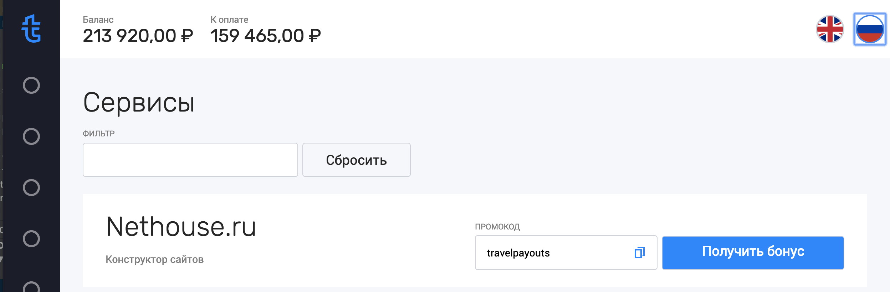

## System Requirements

Локально должны быть установленны:

1. [nodejs](https://nodejs.org/)
2. npm (обычно постаяляется вместе с nodejs)

## Установка

Клонируем проект и устанавливаем зависимости с помощью npm

```
$ git clone https://github.com/IKatsuba/tps.git
$ cd tps
$ npm i
```

Во время установки у некоторых пользователей могут возникнуть проблемы с модулем [node-sass](https://github.com/sass/node-sass). В readme.md этого пакета есть небольшие гайды по их утсранению.

## Запуск

Запускаем проект с помощью npm, выполнив следующую команду в корне проекта:

```
$ npm start
```

После запуска dev-сервера должен открыться браузер по адресу [http://localhost:3000](http://localhost:3000). Если автооткрытия не произошло откройте адрес вручную.

## Особенности

Проект сгенерирован с помощью [create-react-app](https://github.com/facebook/create-react-app) с флагом об использовании TypeScript и npm. Функциональность, отвечающая за serviceWorker'ы, тесты или другие аспекты приложения, не относящиеся к заданию, мной не перерабатывалась и не писалась.

Т.к. под рукой нет быстрого доступа к машинам с живым IE11 его поддержка не была предусмотрена. Были использованы некоторые фичи без полифилов (например, `String.prototype.includes`), в том числе псевдоклассы типа `:focus-within`.

В верхний правый угол экрана мной был добавлен переключатель языка (на макете он отображен не был)



Для форматирования валют и цен используется нативный Intl, по этому их отображение будет зависит от браузера.

## Production build

Продуктовая сборка не проверялась и не оптимизировалась. Но если наслово верить facebook и команде `create-react-app`, то приложение изначально генерируется как production ready. Для запуска сборки нужно лишь выполнить в корне:

```
$ npm run build
```

и забрать артефакты из `build/`.